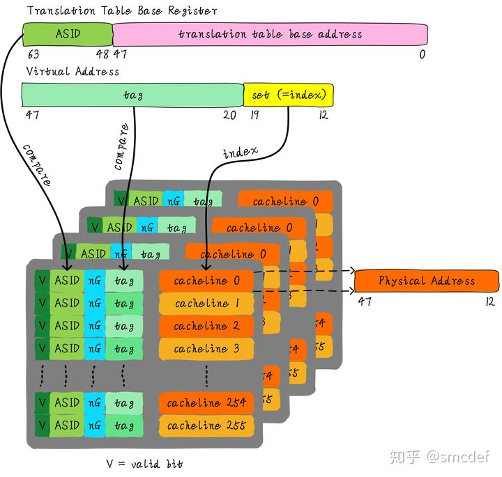

# Lecture 5: Modern Virtual Memory Systems
## Interrupts
### I. asynchronous - an external event
1. input/output device service
2. timer expiration
3. power disruptions, hardware failures
#### details
1. an IO device requests attention by asserting one of the `prioritized interrupt request` lines
2. when the processor decides to process interrupt
    - stops current program at instruction Ii, completing all the instructions up to Ii-1
    - saves `PC` to `EPC`
    - disables interrupts and transfers control to a designated interrupt handler running in kernel mode
### II. synchrounous - an internal event (a.k.a. exception)
1. undefined opcode, privileged instruction
2. arithmetic overflow, FPU exception
3. misaligned memory access
4. virtual memory exceptions: page faults, TLB misses, protection violations
5. traps: system calls, e.g., jumps into kernel
#### details
1. caused by a `particular instruction`
2. instruction cannot be completed and needs to be `restarted` after the exception has been handled (with pipeline, requires undoing the effect of one or more partially executed instructions)
3. in case of a trap(system call), the instruction is considered to have been completed
    - a special jump instruction involving a change to privileged kernel mode.
### III. Interrupt Handler
1. saves `EPC` before enabling interrupts to allow nested interrupts
2. needs to read a `status register` that indicates the cause of the interrupt
3. uses a special indirect jump instruction RFE (return-from-exception) that
    - enables interrupts
    - restores the processor to the user mode
    - restores hardware status and control state
## Speeding up the Common case - TLB & Cache organization
### I. Address Translation in CPU
### II. Virtual Address Caches
#### advantages
one-step process in case of a hit
#### disadvantages
1. to prevent used the old va of before-switched process:
    - flush cache on context switch
    - use ASIDs (address space identifiers) in tag
2. aliasing problems due to the sharing of pages
##### Aliasing in Virtual-Address Caches
1. the problem: two va refers to same pa, read not aware of write
    - general solution: disallow aliases to coexist in cache
    - software (i.e. OS) solution for direct-mapped cache: VAs of shared pages must agree in cache index bits; this ensures all VAs accessing same PA will conflict in direct-mapped cache
### III. Concurrent Access to TLB & Cache
purpose: we want to use virtual address to index the cache! So after context switch, some blocks in cache are still available
1. index L is available without consulting the TLB
2. cache and TLB accesses can begin simultaneously
3. tag comparison is made after both accesses are completed
4. this can be realized when `L + b <= k`
### IV. Virtual-Index Physical-Tag Caches
1. use at least n-way associative cache to make `L + b = k`
2. is this scheme realistic? not sure
### V. a solution via Second-Level Cache
may increase latency?
#### Anti-Aliasing Using L2
add one more tag `a` in L2 will also work
#### Virtually Addressed L1
add the whole VA in L2 -> then what's the purpose of L1???
## Modern Usage
### I. Page Fault Handler
1. when the referenced page not in DRAM
    - missing page located (or created)
    - brought in from disk, page table updated
    - if no free pages are left, a page is swapped out
        - Psuedo-LRU
2. since it takes a long time to transfer a page (ms), page faults are handled completely in software by the OS
### II. Swapping a Page of a Page Table
1. a PTE in primary memory contains: primary or secondary memory addresses
2. a PTE in secondary memory contains: only secondary memory addresses
3. a page of a PT can be swapped out only if none of its PTE's point to pages in the primary memory
    - why? nonsense to make page in primary memory and PTE in secondary memory, lookup will be more expensive than read!
### III. Hashed Page Table
1. typically 2~3 times larger than the number of PPNs to reduce collision probability
2. it can also contain DPNs for some non-resident pages
3. if a translation cannot be resolved in this table then the software consolts a data structure that has an entry for every existing page
### IV. Virtual Memory Use Today
1. full demand-paged virtual memory
    - portability between machines
    - protection between users
    - share small physical memory among active tasks
    - simplifies implementation of some OS features
2. vector supercomputers and GPUs have translation and protection but not demand paging
    - dont waste expensive processor time thrashing to disk (make jobs fit in memory)
    - mostly run in batch mode
    - difficult to implement restartable vector instructions
3. most embedded processors and DSPs (digital signal processor) provide physical addressing only
    - can't afford area/speed/power for vm support
    - often there is no secondary storage to swap to
    - programs custom-written for particular memory configuration in product
    - difficult to implement restartable instructions for exposed architectures
## Note: Linux TLB (48bit address bus)
1. memory structure: 4 level of pagetables: 
    - `PGD` (Page Global Directory) -> `PUD` (Page Upper Directory) -> `PMD` (Page Middle Directory) -> `PTE` (Page Table Entry)
2. avoid TLB flush when context switch (too expensive!)
### I. ASID (Address Space ID)
 \\
cache entry:
- valid bit: V
- ASID: each process has its own ASID, refer to current table base register. Note it's only 16 bit (65536)
- nG: non-global bit: if its global (i.e. kernel space/shared memory), it will be valid for all process
- tag: bit 20 to bit 47 (36bits), which is [index of PGD PUD PMD]
### II. when to flush TLB
1. when all ASIDs are assigned over, flush the whole TLB
2. when map va to pa, flush corresponding TLB entry
### III. the flow
TLB hit if:
```
v && (this.ASID == ASID || !ng) && tag == tag 
```
handled by hardware
### IV. size TLB can store
for example: 128 entries, each Page 4KB, TLB can store references to 128 * 4 = 512KB.