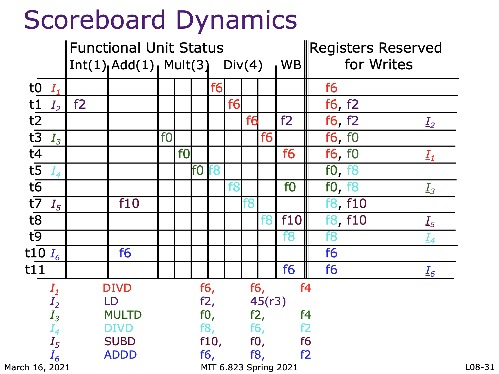

# Lecture 8: Complex Pipelining
## Floating Point ISA
### I. MIPS ISA
1. separate register files for FP and Integer instructions, only interaction is `mov` (some dont even permit this)
2. separate load/store for FPR's and GPR's but both use GPR/s for address calculation
3. separate conditions for branches
### II. Floating Point Unit
1. much more hardware than an integer unit
2. single-cycle floating point unit is a buad idea
    - common to have several floating point units
    - common to have different types of FPUs
    - an FPU may be pipelined, partially pipelined or not pipelined
### III. Functional Unit Characteristics
functional unit have internal pipeline registers
- operands are latched when an instruction enters an FU
- inputs to an FU (e.g. register file) can change during a long latency operation
### IV. Realistic Memory Systems
- latency much higher than 1 cycle and often-unpredictable
- common approach to improving memory performance
    - separate code and data
    - caches: single cycle except in case of a miss => stall
    - interleaved memory, multiple memory accesses => bank conflicts
    - split-phase memory operations => out-of-order responses
## Complex Pipeline
### I. issues
1. `structural hazards` at the execution stage if some FPU or memory unit is not pipelined and takes more than one cycle
2. `structural hazards` at the write back stage due to variable latencies of different function units
3. `out-of-order write hazards` due to variable latencies of different function units
### II. Superscalar In-Order Pipeline
1. fetch 2 instructions per cycle, issue both simultaneously if one is integer/memory and other is floating point
2. inexpensive way of increasing throughput
3. can be extended to wider issue but register file ports and bypassing cost grow quickly
### III. Scoreboard
a hardware data structure to detect hazards dynamically
#### A. when is it safe to issue an instruction
1. approach: stall issue until sure that issuing will cause no dependence problems
2. suppose a data structure keeps track of all the instructions in all the functional units
3. the following checks need to be made before the issue stage can dispatch an instruction
    - is the required function available?
    - input data available? RAW
    - safe to write? WAR, WAW
    - structural conflict at the WB stage
#### B. use a data structure for correct issues
```
function name   | Busy  | Op Dest Src1 Src2
```
#### C. Simplify the Data Structure Assuming In-Order Issue
1. suppose instruction is not dispatched by the issue stage - (RAW or FU busy)
2. suppose operands are latched by the functional unit on issue - can the dispatched instruction cause a (WAR, WAW)
3. no WAR hazard => no need to keep track of src1 and src2
4. the `issue stage` does not dispatch an instruction in case of a WAW hazard => a register name can occur at most once in the `dest` column
5. WP[reg #]: a bit-vector to record the registers for which writes are pending => set true at `issue stage` and false at `write back stage`, each pipeline stage in the FU's must carry the `dest` field and a flag to indicate if it is valid
#### D. Scoreboard for In-Order Issues
1. Busy[FU #]: bit vector to indicate FU's availability
2. WP[Reg $]: ...
#### E. Scoreboard Dynamics - nice explaination
